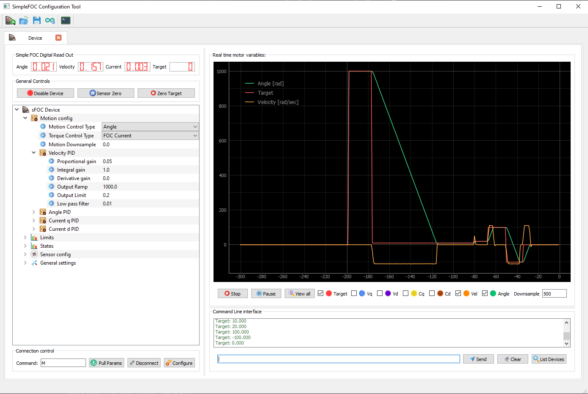
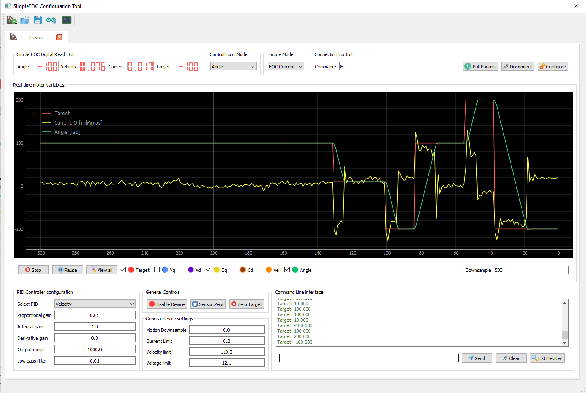
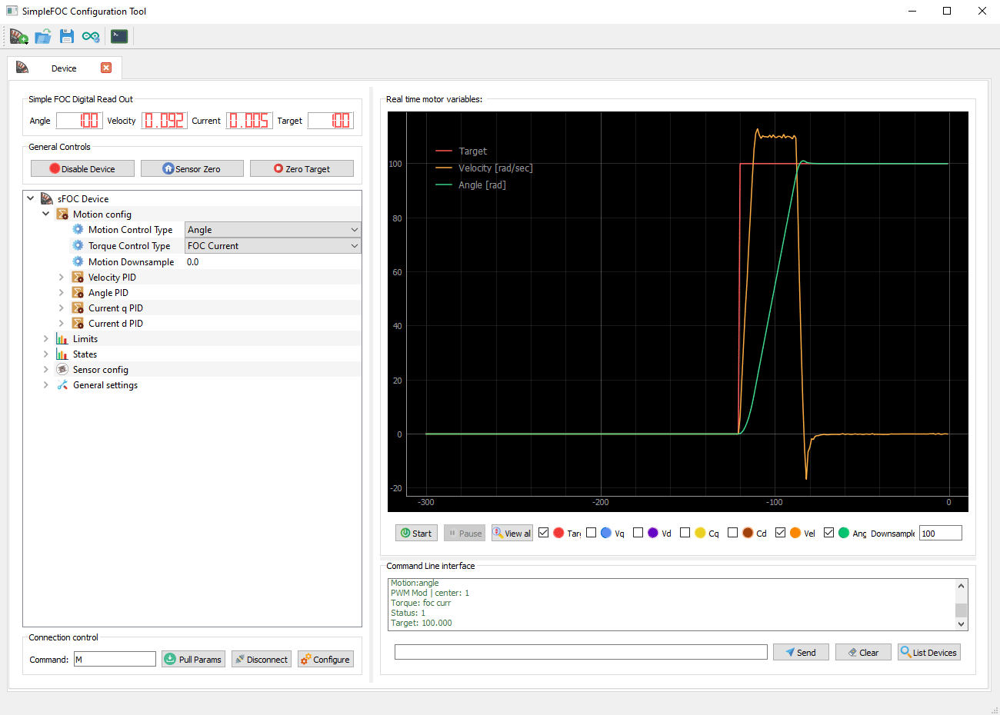
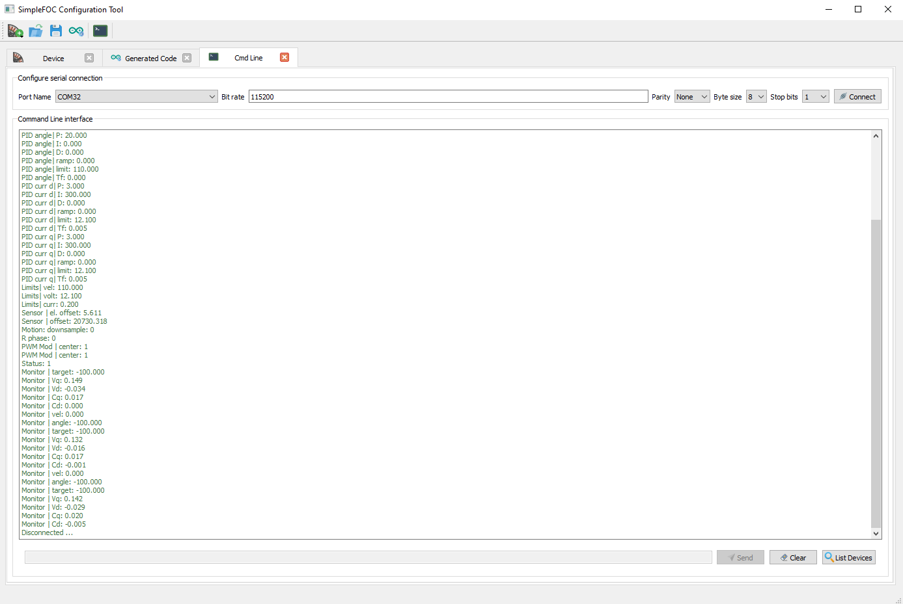

## SimpleFOCStudio 汉化版中文自述


SimpleFOCStudio 是基于 PyQt5 的图形化工具，用于通过串口或无线（TCP）连接对基于 SimpleFOC 库的 BLDC/步进电机控制器进行实时调参、监控与代码生成。

### 主要功能
- 即插即用（针对 SimpleFOC v2.1）
- 电机参数实时整定（PID/LPF、限幅、扭矩/控制模式等）
- 实时曲线监控（角度、速度、电压/电流等）
- 一键生成 Arduino 参数代码，便于将整定结果迁移到固件
- 集成串口终端与自定义命令面板

### 环境要求
- Python 3.9（建议）
- 依赖：见 `requirements.txt`

### 安装步骤
1) 安装 Python（或使用 Anaconda 创建环境）：
```sh
conda create -n simplefoc python=3.9.0
conda activate simplefoc
```
2) 安装依赖：
```sh
pip install -r requirements.txt
```

### 启动程序
```sh
python simpleFOCStudio.py
```
（使用 Anaconda 时，先 `conda activate simplefoc` 再运行上面命令。）

### 快速上手
1) 打开程序后，点击工具栏中的“添加电机”按钮（小电机图标），选择“树形视图”或“表单视图”。
2) 配置连接：
   - 串口：选择端口、波特率等参数，点击“连接”。
   - 无线：在“配置连接”对话框选择“无线”，填写 IP 和端口后连接。
3) 连接成功后可在界面中：
   - 修改控制模式（力矩/速度/角度/开环等）与 PID/LPF 参数；
   - 设置限幅（速度/电压/电流），传感器零点/电气零偏；
   - 在“图形”页查看实时曲线；
   - 使用“点动控制”面板进行简单目标控制；
   - 打开“命令行”窗口查看/发送 Commander 指令。

#### 运动控制调参窗口（示意）

在工具栏点击添加电机后，可选择树形视图或表单视图进行调参：

<p align="center">
  
  
  <br>
  <em>左：树形视图；右：表单视图</em>
  <br>
  - 首次使用先点击“配置”图标设置串口参数<br>
  - 设置 Commander 命令字母（如 `M`），再点击“连接”图标完成连接
  
</p>

### 代码生成（Arduino）
当参数整定完成后，在工具栏点击“生成代码”，选择需要生成的参数组，系统会在新标签页中生成对应的 Arduino 片段，将其复制到固件 `setup()` 初始化附近（`motor.init()` 之前）即可。

<p align="center">
  
</p>

### 自定义命令
若在固件中扩展了 Commander 接口（如 `command.add('M', doMotor, "motor")`），可在“自定义命令”树中添加命令并执行，用于修改寄存器、触发动作等。

<p align="center">
  
</p>

执行方式：在树中选中某个自定义命令后，按“空格键（⎵）”或“右方向键（→）”即可执行。

### 集成串口终端
命令行窗口会显示设备的原始输出，也可直接发送 Commander 指令。

<p align="center">
  
</p>

提示：如下消息为下位机（固件）输出，非上位机生成：
- `D-BOT ESP32S3 SimpleFOC Device`
- `FOC READY`
- `Wireless Tuning Server Ready`

### 常见问题（FAQ）
- 无法连接串口？
  - 确认端口号与波特率，检查占用情况与驱动。
- 无法连接无线？
  - 核对 IP/端口，确保固件侧开启了 TCP 服务器，并处于同一网络。
- 曲线无数据？
  - 在“图形”页点击“开始”，确认固件侧 `motor.monitor()` 与监控变量配置正确。

### 打包（可选）
可使用 PyInstaller 本地打包：
```sh
pyinstaller -F -w simpleFOCStudio.py
```

### 目录结构简述
- `src/gui/`：界面代码（工具栏、主窗口、各配置面板、资源）
- `src/simpleFOCConnector.py`：上位机与设备通信与数据解析
- `DOC/`：示例动图与截图

### 许可证
详见仓库中的 `LICENSE` 文件。


### Jogging 面板（按钮说明）

<p align="center">
  
</p>

- 快速反向（Fast Reverse）：将当前目标值减少为“增量”的 2 倍。
- 反向（Reverse）：将当前目标值减少“增量”。
- 正向（Fordward）：将当前目标值增加“增量”。
- 快速正向（Fast Fordward）：将当前目标值增加为“增量”的 2 倍。
- 停止（Stop）：
  - 角度控制模式：将当前角度设置为目标角度；
  - 速度控制模式：将目标速度置 0。

### Arduino 示例代码

以下示例与英文版 README 保持一致，展示了 Commander 接口与监控的基本用法：

```cpp
#include <SimpleFOC.h>

// ... 其他初始化代码

// 引入 Commander 接口
Commander command = Commander(Serial);
void doMotor(char* cmd) { command.motor(&motor, cmd); }

void setup(){
  // ... 传感器、电机、驱动等初始化

  // 将电机加入 Commander 接口
  // 字母（如 'M'）需与 SimpleFOCStudio 中设置一致
  command.add('M', doMotor, "motor");

  // 启用监控
  motor.useMonitoring(Serial);
  motor.monitor_downsample = 0; // 初始可关闭监控（可选）
}

void loop(){
  // ... 你的循环逻辑

  // 实时监控
  motor.monitor();
  // 实时 Commander 调用
  command.run();
}
```


### 版权声明
- 本项目的著作权及其相关权利归原作者/原仓库所有。
- 本人仅对界面与文档进行中文本地化（汉化）等轻量改动，不涉及核心功能逻辑的原创性变更。
- 本项目的使用、复制、修改与分发，均应严格遵循原仓库的许可协议（LICENSE）；如与本文档描述存在差异，以原许可文件为准。
- 若原作者或版权方对此有进一步要求，请以其公告为准，并可联系我进行相应调整或移除。


